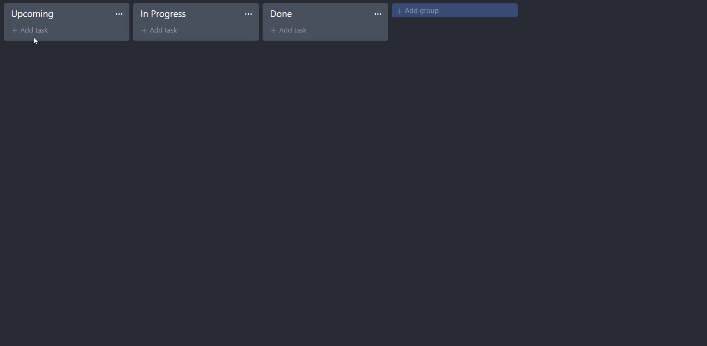

Project for test DragNDrop(some functionality from trello) on React([Link to preview gif](#preview-of-the-project))

&nbsp;

<strong>Link to GitHub-Pages of this app:</strong>
<strong><a href="https://snapsterr.github.io/dnd-test/">DragNDrop-test</a></strong>

&nbsp;

<strong>To start the project follow the next steps:</strong>

- 'npm install'
- 'npm i node-sass'
- 'npm start'

<strong>Functionality of the DragNDrop-test project:</strong>

- creating new lists;
- creating new tasks;
- change the title of the list by clicking on this area and save it by clicking outside the box after editing or on enter key;
- open context menu with actions by clicking icon on the top right side of list:
  1. copy submenu - copy selected list with new title;
  2. move submenu - move selected list from current position to typed;
  3. delete submenu - delete selected list;
- move a task from one list to another by dragging it to the desired column of the list;
- change task status to completed or not(completed tasks with green background and line-through on text while no hover)
- control buttons on task hover with(from left to right):
  1. button that sets the task to completed (if the task is completed, it changes to the opposite button);
  2. button for editing(dissapear if task is complited). For save edited task click button / by clicking outside the box;
  3. button for deleting task;
- list is saving in localstorage.

&nbsp;

### Preview of the project

&nbsp;

